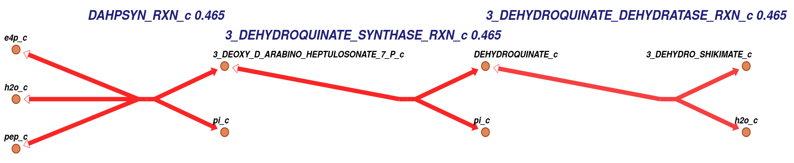

============
Introduction
============

CobraMod is a Python 3 open-source package for pathway-centric curation of
genome-scale metabolic models (GEMs). It builds upon the
`COBRApy toolbox <https://opencobra.github.io/cobrapy/>`_
and offers a comprehensible set of functions for semi-automated network
extension, curation and visualization. CobraMod supports all databases from the
`BioCyc collection <https://biocyc.org/>`_, the
`KEGG database <https://www.genome.jp/kegg/>`_, and the
`BiGG Models repository <http://bigg.ucsd.edu/>`_. and can directly interact
with Escher for pathway and flux
visualization.

This package converts the pathway information into native COBRApy objects and
quality-checks for multiple criteria. During the creation process, these
objects will be tested for:

- duplicate elements in the model
- correct chemical formula according to the data
- mass balance of reactions
- reaction reversibility
- capability to carry non-zero fluxes

CobraMod offers an user-friendly tracking of the curation process. Every time
our package adds a set of reactions (Pathway-object) to the model a summary is
outputted and the complete curation procedure is written to a log file. If any
of the curation criteria is not met or exceptions are encountered, CobraMod
passes a warning through the Python console and the log file.

CobraMod uses `Escher <https://escher.github.io/>`_ to visualize flux
distributions and pathways. Each
Pathway-object includes a visualization method (visualize) which automatically
generates pathway maps of the respective set of reactions. These pathway maps
can be easily customized to visualize flux distributions using default or
user-defined colors and linear gradients or quantile normalized.

This package offers multiple functions for modifying and extending GEMs:

- Retrieve metabolic pathway information from a database
  :func:`cobramod.get_data`
- Transform stored data into COBRApy objects :func:`cobramod.create_object`
- Add metabolites from multiple sources :func:`cobramod.add_metabolites`
- Add reactions from multiple sources :func:`cobramod.add_reactions`
- Test reaction capability to carry a non-zero flux
  :func:`cobramod.test_non_zero_flux`
- Add pathway to a model :func:`cobramod.add_pathway`

Users can add the biochemical data through different methods:

- Using a text file with the identifiers of the objects, or the whole
  attributes for a curated reactions or metabolites
- Using a single string with the identifier of the object
- Using regular COBRApy objects

Additionally, CobraMod includes a new type of :class:`cobra.core.group.Group`,
namely :class:`cobramod.Pathway`. This Pathway-object includes the new method
:func:`cobramod.Pathway.visualize` to create a pathway map.

For more information, read the corresponding docstrings of the functions using
`help()` or
read the :doc:module/functions to learn more about these functions.

To know the databases that work with CobraMod, load and print
:obj:`cobramod.available_databases`.

.. toctree::
   :maxdepth: 1
   :numbered:
   :caption: Contents

   how_to.ipynb
   installation.rst
   API <module/cobramod/index>

.. toctree::
   :maxdepth: 0
   :caption: Test case
   :numbered:

   Ecoli scenario <shikimate.ipynb>
   Glucosinolate scenario <GLS.ipynb>
